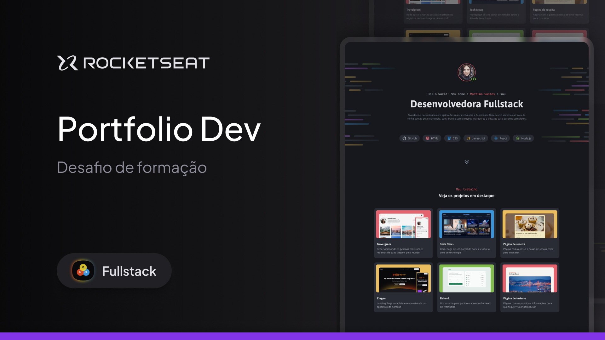

<h1 align="center"> Portifolio dev </h1>

Este projeto foi parte de um desafio da trilha Fullstack promovido pela plataforma de cursos Rocketseat. 

  <a href="#-tecnologias">Tecnologias</a>&nbsp;&nbsp;&nbsp;|&nbsp;&nbsp;&nbsp;
  <a href="#-projeto">Projeto</a>&nbsp;&nbsp;&nbsp;|&nbsp;&nbsp;&nbsp;
  <a href="#-layout">Layout</a>

 

  

## 🚀 Tecnologias

Esse projeto foi desenvolvido com as seguintes tecnologias:

- HTML, CSS: para criar uma estrutura sólida e estilizar a página.
- Design Responsivo: para garantir uma experiência de visualização impecável em diversos dispositivos.
- Style Guide: Seguindo as diretrizes fornecidas pelo layout no Figma.

## 💻 Projeto

Este projeto foi parte de um desafio proposto pela plataforma de cursos Rocketseat. O objetivo do desafio era construir uma landing page de portfólio para um desenvolvedor Fullstack, a partir de um layout fornecido pela plataforma. Não foram fornecidas orientações adicionais, desafiando os participantes a implementarem o projeto de forma autônoma, com base apenas no design apresentado.

- [Acesse o projeto finalizado, online](https://guithr.github.io/portifolio-dev/)

## 🔖 Layout

Você pode visualizar o layout do projeto através [DESSE LINK](https://www.figma.com/community/file/1387080701963671866/portfolio-dev).
